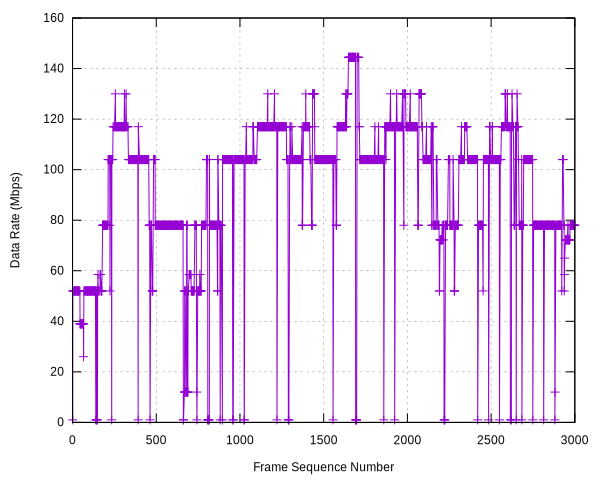
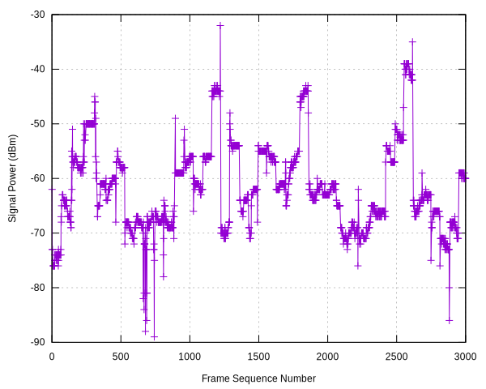

# Wireshark

## Packet Capture Setup

We use the `tshark` command line tool provided by `wireshark-cli` to capture packets.
The `-I` flag sets the interface to monitor mode.
The `-T` flag translates the data to `json` format.
The `-V` flag causes the packet information to be printed in `stdout`.
We redirect the data from `stdout` to the file `sample.json` for post processing.

```{.bash}
sudo tshark -V -I -T json > sample.json
```

`sample.json` contains annotated data of each packet with their corresponding fields.
In this example we are interested in physical layer information.
We extract the signal power (in dBm) and data rate values from each packet.
`jq` command line tool extracts the specified fields from the `sample.json` file.

```{.bash}
jq --raw-output '.[] | select(."_source"."layers"."wlan_radio" | type == "object") | select(."_source"."layers"."wlan_radio"."wlan_radio.signal_dbm" != null) | "\(."_source"."layers"."frame"."frame.number") \(."_source"."layers"."wlan_radio"."wlan_radio.signal_dbm") \(."_source"."layers"."wlan_radio"."wlan_radio.data_rate")" sample.json > data.csv
```

## Plotting Data

```{.gnuplot}
set term qt persist

set grid
set xlabel 'Frame Sequence Number'
set ylabel 'Data Rate (Mbps)'


plot\
'../csv/data.csv' using 1:3 title '' with linespoints, \
```

```{.gnuplot}
set term qt persist

set grid
set xlabel 'Frame Sequence Number'
set ylabel 'Signal Power (dBm)'


plot\
'../csv/data.csv' using 1:2 title '' with linespoints, \
```

{width=49%}
{width=49%}
